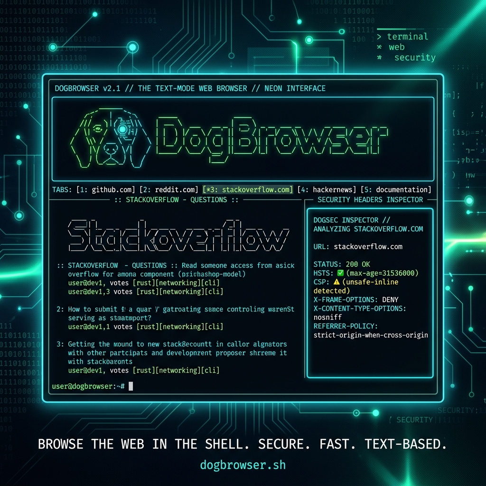

<h1 align="center">
   DogBrowser
</h1>

<p align="center">
  <strong>Terminal Browser for Bug Bounty Hunters & Security Researchers</strong>
</p>

<p align="center">
  <a href="https://github.com/Prekarshamaxx123">
    
  </a>
  
  
  
  
</p>

---

## 📸 Screenshots

<p align="center">
  
</p>

---

## 🌐 What is DogBrowser?

DogBrowser is a **terminal-based web browser** built with Python and the [Textual](https://textual.textualize.io/) TUI framework. It is designed for **security engineers, bug bounty hunters, and OSINT researchers** who want to inspect web pages, analyze security headers, audit cookies, extract forms, and recon endpoints — all without leaving the terminal.

---

## ✨ Features

### 🌍 Web Browsing
- Navigate websites with **clickable links**, mouse support, and keyboard navigation
- **Multi-tab architecture** — browse multiple pages concurrently
- **Smart URL resolver** — type URLs, search queries, or use DuckDuckGo bangs (`!g query`, `!yt query`)
- **User-Agent cycling** — press `Ctrl+U` to switch between mobile, desktop, and bot UAs
- **YouTube support** — view trending videos, search results, and video metadata via `yt-dlp`
- **ANSI media rendering** — download and display images as terminal ANSI art
- **DuckDuckGo bang support** — custom search shortcuts (`!gh`, `!so`, `!w`, etc.)

### 🔒 Security Analysis (F-Keys)

| Key | Panel | What it does |
|-----|-------|-------------|
| `F1` | **Help** | Keybindings reference |
| `F2` | **Headers** | Inspect request/response headers + security audit |
| `F3` | **Cookies** | View cookies with `Secure`, `HttpOnly`, `SameSite` flag analysis |
| `F4` | **Forms** | Detect HTML forms, hidden inputs, and submit directly |
| `F5` | **Links** | List all internal/external links on the page |
| `F6` | **JavaScript** | Identify external JS files and inline scripts |
| `F7` | **Source** | View and **edit** syntax-highlighted HTML source |
| `F8` | **Tech** | Automatic technology fingerprinting (server, frameworks) |
| `F9` | **SSL/TLS** | Full certificate details (subject, issuer, cipher, SANs) |
| `F10` | **Params** | Discover URL query parameters for fuzzing |
| `F11` | **Comments** | Find hidden HTML comments |
| `F12` | **Recon** | Automated path reconnaissance (`/robots.txt`, `/.env`, `/admin`, etc.) |

### 🛠 Developer Tools
- **Repeater** (`Ctrl+Y`) — craft and send custom HTTP requests (GET/POST) with custom headers and body
- **Cookie editor** — add, modify, or clear cookies interactively
- **Source editor** — edit HTML live and re-render in the terminal
- **Export** (`Ctrl+E`) — save full security audit data as JSON
- **Clipboard integration** — right-click to copy/paste across all panels

### 📦 Code Protection
- Built-in **symmetrical packer** (`tools/packer.py`) to obfuscate source before sharing

---

## 🚀 Installation

### Prerequisites

- **Python 3.9+** installed on your system
- `pip` package manager
- (Optional) `yt-dlp` for video metadata — installed automatically

### Quick Install (Recommended)

```bash
# Clone the repository
git clone https://github.com/Prekarshamaxx123/dog-browser.git
cd dog-browser

# Run the interactive installer
python installer.py
```

The installer will:
1. Create a Python virtual environment (`.venv`)
2. Install all dependencies (`textual`, `httpx`, `beautifulsoup4`, `Pillow`, `yt-dlp`, etc.)
3. Create a global `DogBrowser` command:
   - **Windows**: `DogBrowser.bat` added to your `PATH`
   - **Linux/macOS**: Symlink in `~/.dogbrowser/bin` + shell export

After installation, run from anywhere:
```bash
DogBrowser
```

### Manual Install

```bash
git clone https://github.com/Prekarshamaxx123/dog-browser.git
cd dog-browser
python -m venv .venv

# Windows
.venv\Scripts\activate
# Linux/macOS
source .venv/bin/activate

pip install -r requirements.txt
python main.py
```

---

## ⌨️ Keyboard Shortcuts

| Shortcut | Action |
|----------|--------|
| `Ctrl+L` | Focus URL bar |
| `Ctrl+R` | Reload current page |
| `Ctrl+T` | New tab |
| `Ctrl+W` | Close tab |
| `Alt+Left` / `Alt+Right` | Switch tabs |
| `Ctrl+B` | Toggle sidebar |
| `Ctrl+U` | Cycle User-Agent |
| `Ctrl+E` | Export session as JSON |
| `Ctrl+Q` | Quit |
| `Tab` / `Shift+Tab` | Navigate links |
| `Enter` | Open focused link |
| `↑` / `↓` | Scroll |
| `PgUp` / `PgDn` | Page scroll |
| `F1` – `F12` | Security panels |

---

## 🧪 Usage Tips

- **Search the web**: Just type your query in the URL bar — it auto-searches DuckDuckGo
- **Use bangs**: `!gh textual` searches GitHub; `!yt python` searches YouTube
- **Cycle UA**: If a site blocks you, press `Ctrl+U` to switch User-Agent
- **Copy any text**: Right-click on text blocks, links, or panels to copy
- **Follow redirects**: DogBrowser tracks redirect chains and shows them in the page header
- **Edit HTML live**: Press `F7` → click "Edit HTML" → modify → Apply & Re-render

---

## 🤝 Support

Created and maintained by **Prekarshamaxx123**.

- GitHub: [github.com/Prekarshamaxx123](https://github.com/Prekarshamaxx123)

If you find DogBrowser useful, please ⭐ star the repository!

---

## 📄 License

DogBrowser is open-source under the [MIT License](LICENSE).
